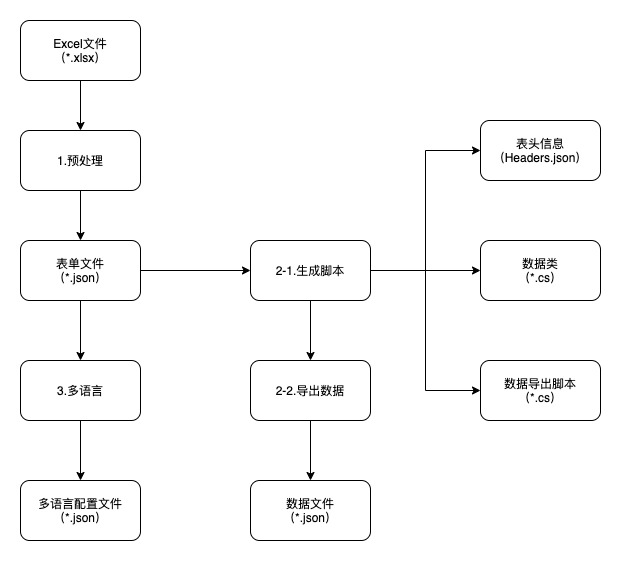

# Unity-Excel2Json-Tool

---

## 项目介绍

这是一个简单的Excel导表工具，可以导出json数据、类脚本、多语言文本



## 使用教程

### 1 - 预处理，生成表单文件


```
把Excel文件转为Json格式，配合版本管理，如git、svn，能看到数据的修改情况
```

### 2 - 生成脚本和导出数据


```
2-1.生成脚本，包含以下几种文件
- Headers.json 记录了表头信息
- *.cs和*Data.cs 枚举和数据类定义
- Editor/CSharpDataExporter.cs 用于导出数据文件
2-2.导出数据文件（json格式）
- *Data.json
```

### 3 - 多语言，导出多语言配置文件


```
请配合LanguageManager.cs使用
```

---

## 其他

```
1. Settings上可以配置文件生成路径
2. Excel格式请参考Example/Excels文件夹里面的例子
3. 支持的数据类型int、bool、float、string、枚举
4. 支持链表
5. 不支持嵌套
```


